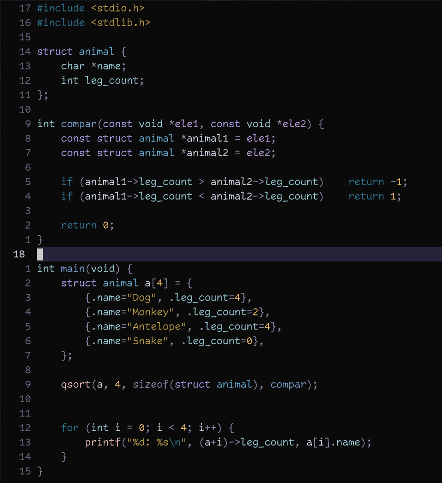

# Everblush.nvim 🌌

A soothing dark Neovim colorscheme for long coding sessions



## Features

- 🎨 Carefully curated color palette
- 🌑 Soft black background
- 📦 Easy installation with Lazy.nvim
- 📊 Built-in Lualine theme
- 🌍 Supports 20+ languages

## Installation

```lua
{
  "srt0/everblush.nvim",
  lazy = false,
  priority = 1000,
  config = function()
    require("everblush").setup({
      transparent = false, -- Set to true for transparency
    })
    vim.cmd.colorscheme("everblush")
  end,
}
```

## 🛠️ Full Configuration Example

Add this to your `init.lua` for a complete setup with Lualine and Treesitter:

```lua
require("lazy").setup({
  {
    "srt0/everblush.nvim",
    lazy = false,
    priority = 1000,
    config = function()
      -- Initialize Everblush with transparency option
      require("everblush").setup({
        transparent = false, -- Set to true for transparent background
      })
      vim.cmd.colorscheme("everblush")
      
      -- Configure Lualine (optional but recommended)
      require("lualine").setup({
        options = {
          theme = require("everblush.lualine").theme,
          component_separators = "|",
          section_separators = "",
        }
      })
    end,
    dependencies = {
      "nvim-lualine/lualine.nvim",
      "nvim-treesitter/nvim-treesitter",
    }
  }
})

-- Configure Treesitter (required for syntax highlighting)
require("nvim-treesitter.configs").setup({
  ensure_installed = { "c", "go", "python", "lua", "rust" }, -- Add your languages
  auto_install = true,
  highlight = {
    enable = true,
    additional_vim_regex_highlighting = false,
  }
})
```

## 🌈 Requirements
- Neovim 0.9.0+
- Terminal with true color support ([how to verify](https://gist.github.com/XVilka/8346728))
- `nvim-treesitter` (auto-installed but needs compilation)

## 🔧 Troubleshooting
If colors don't appear correctly:
1. Verify true color support: `:echo has('termguicolors')` should return `1`
2. Check colorscheme is loaded: `:colorscheme` should show `everblush`
3. Ensure Treesitter parsers are installed: `:TSUpdate`

## Credits

Color palette inspired by Rose Pine and Tokyo Night themes.
